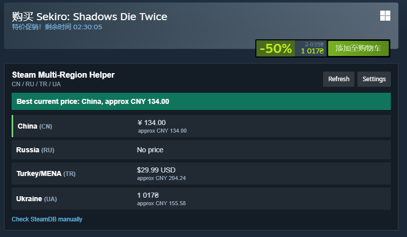
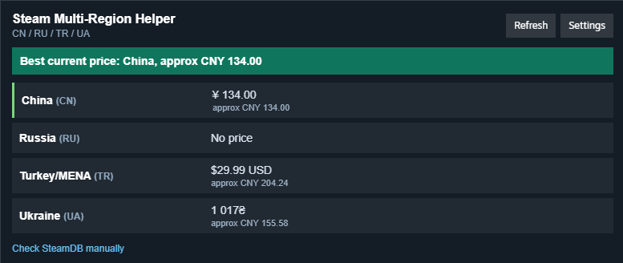
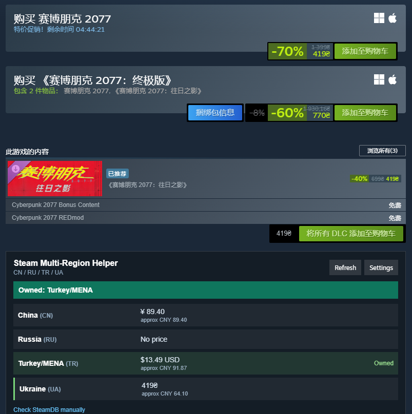
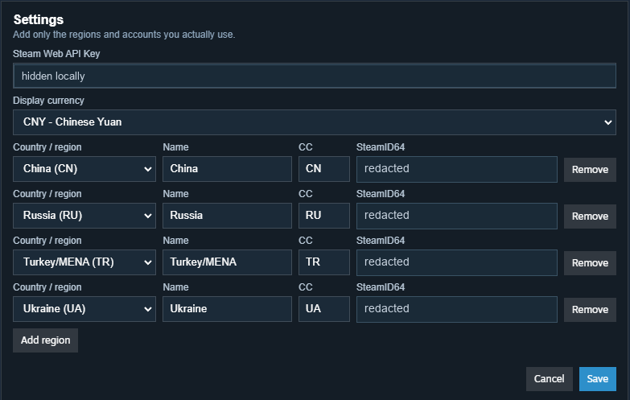
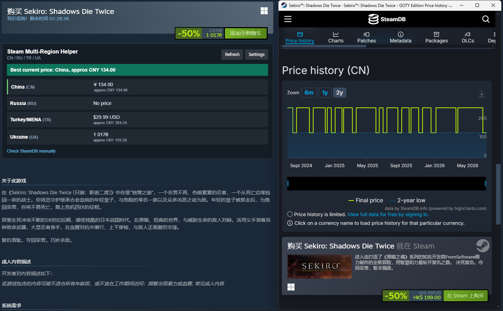

# Steam Multi-Region Helper

A small unofficial Millennium plugin for the Steam desktop client.

It shows current Steam prices and owned status for the regions/accounts you configure. It is meant for users who already own multiple Steam accounts and want a quick way to avoid duplicate purchases.


[中文说明](README.zh-CN.md)

## Screenshots

Real Steam client screenshots. The main price-comparison examples use Sekiro: Shadows Die Twice, appid `814380`; the owned-status example uses Cyberpunk 2077.

### Store Page Placement

The panel appears near Steam's purchase block, so the regional comparison stays close to the place where you decide whether to buy.



### Helper Panel

The panel keeps the current Steam regional prices, approximate display-currency values, owned status, refresh/settings actions, and SteamDB manual-check link in one compact block.



### Owned Status Example

When one configured account already owns the app, the panel highlights the owned region/account so you can avoid duplicate purchases.



### Settings

Configure only the regions/accounts you actually use, choose country/region presets, and set the display currency for approximate comparisons. Sensitive local values are redacted in this screenshot.



### SteamDB Manual Check

The helper links out to SteamDB for manual historical-price checks instead of scraping or reproducing SteamDB data.



## What it does

- Adds a compact panel to Steam store app pages.
- Lets you configure any number of region/account rows.
- Provides country/region presets and still allows custom two-letter Steam country codes.
- Each row has a display name, Steam country code, and optional SteamID64.
- Compares current Steam Store prices through Steam's store appdetails endpoint.
- Checks owned games through Steam Web API when a SteamID64 is provided.
- Lets you choose a display currency for approximate comparisons.
- Links to SteamDB for manual historical-price checks.

## Known limits

- Owned status is checked by appid. DLC, bundles, editions, and package pages can have more complicated ownership rules, so the panel should be treated as a quick hint rather than an exact entitlement audit for every DLC/package case.

## What it does not do

- It does not buy games.
- It does not bypass regional restrictions.
- It does not automate Steam account actions.
- It does not scrape SteamDB.
- It does not try to determine historical lows.
- It does not ask for or store your Steam password.
- It does not upload your API key, SteamID64, owned-game list, or price results to a project server.

## Steam and privacy notes

This project is not affiliated with, endorsed by, or supported by Valve or Steam.

The plugin uses public Steam Store responses for current price display and the official Steam Web API for owned-game checks. It stores settings in the local Steam client web storage on your machine. There is no project-run backend service.

Using third-party Steam client plugins may carry account or client compatibility risk. Review Steam's current agreements and use the plugin at your own discretion.

See [docs/PRIVACY_AND_STEAM.md](docs/PRIVACY_AND_STEAM.md) for the detailed privacy and Steam boundary notes.

## Data sources

- Current prices: `https://store.steampowered.com/api/appdetails`
- Owned games: `https://api.steampowered.com/IPlayerService/GetOwnedGames`
- Exchange rates: `https://open.er-api.com/v6/latest/CNY`
- Historical price checks: manual SteamDB link only

## Install

See [docs/INSTALL.md](docs/INSTALL.md).

Short version:

1. Install Millennium for the Steam desktop client.
2. Download a release zip.
3. Extract it into your Steam Millennium plugin folder.
4. Restart Steam and enable the plugin.
5. Open a Steam store app page and configure the helper.

## Development

```powershell
npm test
npm run build
npm run install:local
npm run package
```

`npm run package` creates:

`release\steam-multi-region-helper-v0.1.1.zip`

## Contributing

Pull requests are welcome. Please keep the project small and focused: current official Steam prices, configured account ownership checks, and a clean in-client panel.

Before opening a PR, read [CONTRIBUTING.md](CONTRIBUTING.md).
