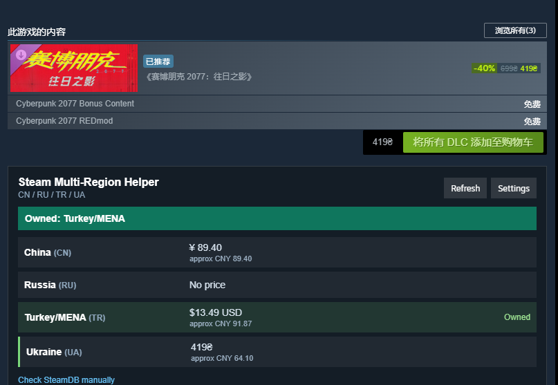
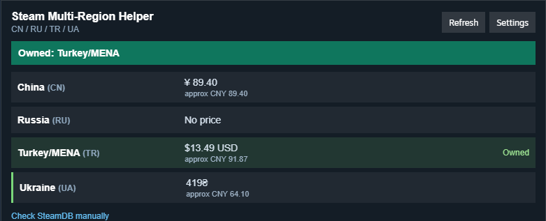
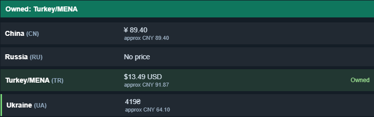

# Steam Multi-Region Helper

一个给 Steam 桌面客户端用的小型非官方 Millennium 插件。

它会在 Steam 商品页里加一个小面板，显示你配置的多个地区当前 Steam 价格，以及哪些账号已经拥有这个游戏。适合已经有多个 Steam 账号、又不想在促销时反复切号查价的人。

[English README](README.md)

## 截图

下面是《赛博朋克 2077》（appid `1091500`）商品页里的真实 Steam 客户端截图。截图不展示 API Key 和账号标识。

### 商品页中的位置

面板会出现在 Steam 购买区和内容区下面，离你决定是否购买的位置很近。



### 助手面板

面板把当前 Steam 各区价格、约合展示货币、拥有状态、刷新/设置按钮和 SteamDB 手动核验入口放在一个紧凑区域里。



### 拥有状态和地区价格行

拥有状态按你配置的账号行展示。地区价格仍然保留 Steam 返回的原始货币，下面显示约合金额。



## 它能做什么

- 在 Steam 客户端商品页显示一个紧凑面板。
- 支持添加任意数量的地区/账号。
- 提供常见国家/地区下拉选项，也允许手动填写两位 Steam 国家代码。
- 每一行可以配置显示名、国家代码和 SteamID64。
- 通过 Steam 商店接口查询当前价格。
- 通过 Steam Web API 查询账号是否拥有该游戏。
- 可以选择展示货币，用于约合金额和当前最低价排序。
- 提供 SteamDB 链接，方便手动核验史低价格。

## 已知限制

- 拥有状态按 appid 判断。DLC、捆绑包、终极版、合集页的拥有关系可能更复杂，所以面板只能当作快速提示，不能保证精确覆盖所有 DLC/包体权益情况。

## 它不做什么

- 不自动购买游戏。
- 不绕过地区限制。
- 不自动操作 Steam 账号。
- 不抓取 SteamDB。
- 不判断史低价格。
- 不要求、也不保存 Steam 密码。
- 不把 API Key、SteamID64、库存列表或价格结果上传到项目服务器。

## 关于 Steam 和隐私

这个项目不是 Valve 或 Steam 官方项目，也没有得到 Valve 或 Steam 背书。

插件会读取 Steam 商品页，使用公开的 Steam 商店响应查询当前价格；如果你填写 Steam Web API Key 和 SteamID64，它会用官方 Steam Web API 查询拥有状态。设置保存在你本机 Steam 客户端的本地存储里，本项目没有自己的服务器。

第三方 Steam 客户端插件本身可能存在账号、客户端兼容性或条款风险。发布文档会尽量写清楚边界，但最终是否使用需要你自己判断。

更详细的隐私和 Steam 边界说明见 [docs/PRIVACY_AND_STEAM.md](docs/PRIVACY_AND_STEAM.md)。

## 安装

详见 [docs/INSTALL.md](docs/INSTALL.md)。

简单版：

1. 安装 Steam 桌面客户端用的 Millennium。
2. 下载 GitHub Release 里的 zip。
3. 解压到 Steam 的 Millennium 插件目录。
4. 重启 Steam，并确认插件已启用。
5. 打开任意 Steam 商品页，在面板里配置地区和账号。

## 开发

```powershell
npm test
npm run build
npm run install:local
npm run package
```

打包产物会生成在：

`release\steam-multi-region-helper-v0.1.1.zip`

## 欢迎 PR

欢迎提交 PR，但希望这个项目保持小而清楚：只做当前 Steam 官方价格对比、配置账号的拥有状态检查，以及 Steam 客户端里的轻量面板。

如果想贡献代码，先看 [CONTRIBUTING.md](CONTRIBUTING.md)。
